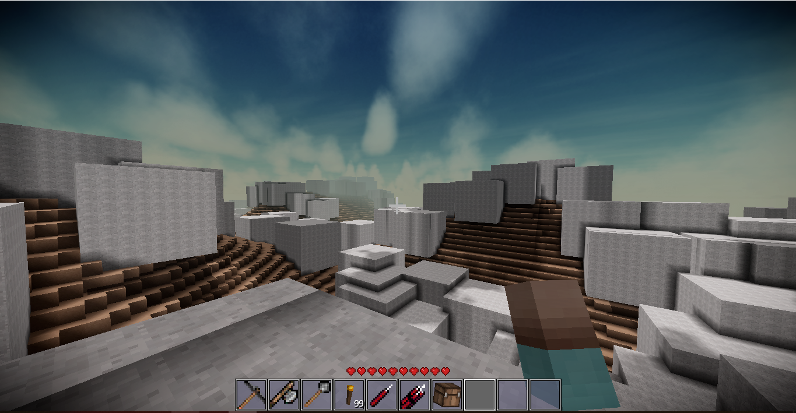

# Tutorial World Generator
It's a simple world generator for [Terasology](https://github.com/MovingBlocks/Terasology).

## How to install the module in the local workspace ?
- Make sure you have the local workspace of [Terasology](https://github.com/MovingBlocks/Terasology) installed.
- Install module command
```
groovyw module get TutorialWorldGenerator -remote iHDeveloper
```

## Screen Shots

